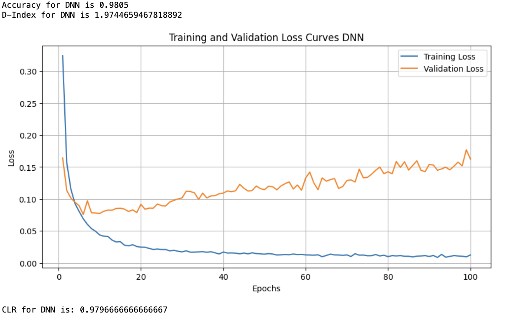
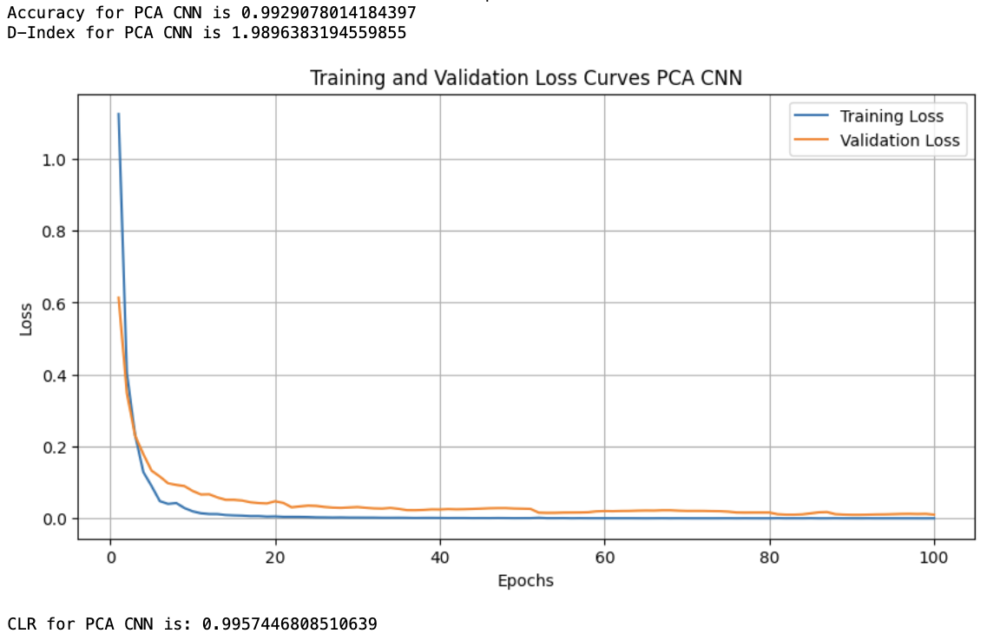
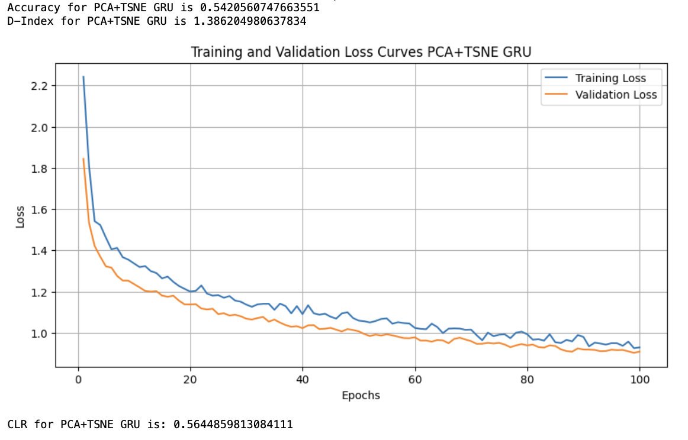
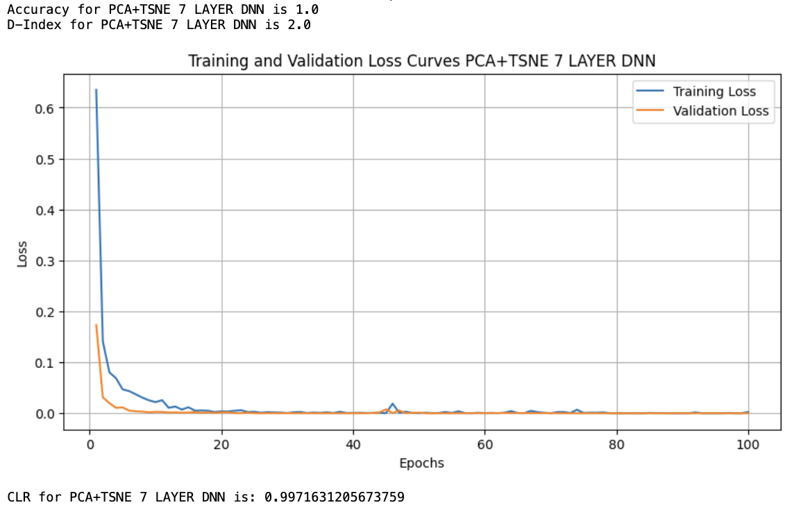

# Case Study: Deep Learning Models Across Multiple Datasets

This project investigates the reproducibility and performance of various deep learning models across three distinct datasets using different preprocessing techniques. The goal is to understand how different combinations of models and preprocessing steps affect the consistency and accuracy of results.

## Overview

### Models Evaluated:
- **DNN (Deep Neural Network)**
- **CNN (Convolutional Neural Network)**
- **LSTM (Long Short-Term Memory)**
- **GRU (Gated Recurrent Unit)**
- **7-Layer Variants**: Extended versions of DNN, CNN, LSTM, and GRU with 7 layers to evaluate the impact of deeper architectures on performance and reproducibility.

### Datasets Used:
1. **EMODB**: A dataset focused on emotion recognition.
2. **MNIST**: A dataset consisting of handwritten digits.
3. **Kolod**: A complex biological dataset with various cell types.

### Preprocessing Techniques:
- **No Preprocessing**: Raw data is fed into the model.
- **PCA (Principal Component Analysis)**: Dimensionality reduction to highlight the most important features.
- **PCA+TSNE (t-Distributed Stochastic Neighbor Embedding)**: A combination of PCA for initial reduction followed by TSNE for visualization and further dimensionality reduction.

## Key Metrics

- **Accuracy**: Measures the proportion of correct predictions.
- **CLR (Cumulative Learning Rate)**: Reflects the consistency of the learning process across multiple runs.
- **D-Index (Diversity Index)**: Indicates the variability in predictions across different runs, with a higher value signifying more stable performance.

## Results Summary

### 1. **No Preprocessing**

**Example: DNN on MNIST Dataset**
- **CLR**: 0.9797
- **Accuracy**: Consistently above 0.9785
- **D-Index**: Low variability, indicating high reproducibility.

**Image Example**:

This model displayed excellent performance with minimal variation across runs, highlighting the robustness of DNN on the MNIST dataset without any preprocessing.

### 2. **PCA**

**Example: CNN on Kolod Dataset**
- **CLR**: 0.9957
- **Accuracy**: Reached 1.0 in several runs.
- **D-Index**: Extremely high, suggesting that PCA greatly enhanced the model's ability to generalize across this complex dataset.

**Image Example**:

The PCA preprocessing step proved beneficial, particularly for the Kolod dataset, where the model achieved near-perfect accuracy in multiple runs.

### 3. **PCA+TSNE**

**Example: GRU on EMODB Dataset**
- **CLR**: 0.6131
- **Accuracy**: Varied between 0.468 and 0.617
- **D-Index**: High variability, reflecting the sensitivity of GRU to complex datasets like EMODB.

**Image Example**:

The PCA+TSNE combination showed high accuracy for complex datasets but with increased variability, highlighting a trade-off between accuracy and reproducibility.

### 4. **7-Layer Architectures**

**Example: 7-Layer DNN on Kolod Dataset with PCA+TSNE**
- **CLR**: 0.9972
- **Accuracy**: Reached 1.0 in multiple runs.
- **D-Index**: Consistently high at 2.0, indicating perfect reproducibility in most runs.

**Image Example**:

The 7-layer architecture provided a significant boost in performance, especially with PCA+TSNE preprocessing on the Kolod dataset. This architecture consistently achieved near-perfect accuracy across all runs, with minimal variability, making it a robust choice for complex datasets.

**Detailed Reference to 7-Layer Architectures**:
The introduction of 7-layer variants for DNN, CNN, LSTM, and GRU models was intended to explore the impact of deeper architectures on model performance and reproducibility. These architectures generally performed better on more complex datasets, such as Kolod, particularly when combined with advanced preprocessing techniques like PCA+TSNE. The increased depth allowed the models to capture more intricate patterns within the data, leading to higher accuracy and lower variability across runs.

However, it is important to note that while deeper architectures tend to perform better, they also come with increased computational costs and the risk of overfitting, especially on smaller datasets like EMODB. Thus, while the 7-layer models excelled in this study, their application should be carefully considered based on the dataset and specific requirements of the task.

## Dataset-Specific Observations

- **MNIST**: All models performed exceptionally well, with DNN and CNN models consistently achieving high accuracy and reproducibility.
- **EMODB**: This dataset posed significant challenges, especially for LSTM and GRU models, which struggled to maintain consistent accuracy.
- **Kolod**: The complex structure of this dataset benefitted greatly from PCA and PCA+TSNE, with CNN and DNN models achieving near-perfect accuracy, particularly in the 7-layer configurations.

### CLR and Conclusion for EMODB Dataset
Our results indicate that PCA+TSNE did not perform as well as PCA alone on the EMODB dataset. While PCA produced more consistent and globally informative features that improved the models' performance, PCA+TSNE, being more suited to exploratory data analysis and visualization rather than feature engineering, led to increased variability and less reliable performance.

### CLR and Conclusion
The datasets, particularly EMODB, presented challenges due to their high-dimensional and sparse nature. Initially, most models performed poorly without any dimensionality reduction. However, after applying PCA and PCA+TSNE, there was a noticeable improvement in performance. PCA, in particular, proved to be more effective for generating consistent and reliable features, leading to better model reproducibility and accuracy.

## Conclusion

This study reveals that the choice of preprocessing techniques and model architectures significantly impacts the reproducibility and performance of deep learning models across different datasets. 

**Key Takeaways**:
- **DNN and CNN models** are robust across most datasets and preprocessing techniques, making them reliable choices for a wide range of applications.
- **LSTM and GRU models** require more careful tuning and may benefit from advanced preprocessing techniques but are more sensitive to the specific characteristics of the dataset.
- **7-Layer Architectures**: These deeper models showed significant improvements in performance, particularly on complex datasets, though they require careful consideration due to their computational demands.
- **Preprocessing**: PCA is a reliable preprocessing step that can enhance model performance, particularly on complex datasets like Kolod. PCA+TSNE can lead to high accuracy but may introduce variability, making it less suitable when reproducibility is a primary concern.

**Final Thought**:
When designing deep learning pipelines, particularly for applications where reproducibility is critical, it is essential to consider both the model architecture and the preprocessing techniques. DNN and CNN models with PCA are generally safe bets, while more advanced techniques should be used judiciously depending on the specific dataset and application requirements.

---

This study highlights the nuanced relationship between model complexity, dataset structure, and preprocessing techniques, providing valuable insights for future deep learning projects.
